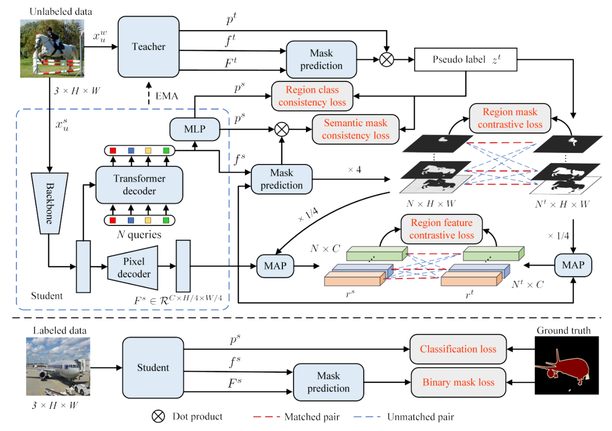

<table style="width:100%;border:None;border-spacing:0px;border-collapse:separate;margin-right:0;margin-left:0;font-size:0.9em;">
  <tr>
    <td style="padding:10px;width:20%;vertical-align:middle;border-right:none;border-bottom:none;">
      <a href="https://github.com/Jiro-zhang/jiro-zhang.github.io/blob/main/images/T2M-GPT.gif">
      
      </a>
    </td>
    <td style="padding:5px;width:80%;vertical-align:middle;border-right:none;border-bottom:none;">
      <b>T2M-GPT: Generating Human Motion from Textual Descriptions with Discrete Representations</b>, 
      <br>
      <a href="https://jiro-zhang.github.io/">Jianrong Zhang*</a>, 
      Yangsong Zhang*, 
      <a href="https://vinthony.github.io/academic/">Xiaodong Cun</a>,
      <a href="https://scholar.google.com/citations?user=o31BPFsAAAAJ&hl=en">Shaoli Huang</a>,
      <a href="https://yzhang2016.github.io/">Yong Zhang</a>,
      Hongwei Zhao, 
      Hongtao Lu, 
      and
      <a href="https://xishen0220.github.io/">Xi Shen<sup>+</sup></a>.
      <br>
      <i>In Proceedings of The IEEE/CVF Conference on Computer Vision and Pattern Recognition (<b>CVPR 2023</b>)</i>.
      <br>
      [<a href="https://mael-zys.github.io/T2M-GPT/">Project page</a>]
      [<a href="https://github.com/Mael-zys/T2M-GPT/blob/main/T2M-GPT.pdf">PDF</a>]
      [<a href="https://github.com/Mael-zys/T2M-GPT">Code</a>]
      [<a href="https://arxiv.org/abs/2301.06052">arXiv</a>]
      [<a href="https://colab.research.google.com/drive/1Vy69w2q2d-Hg19F-KibqG0FRdpSj3L4O?usp=sharing">Colab</a>]
      [<a href="https://huggingface.co/spaces/vumichien/generate_human_motion">Huggingface</a>]
    </td>
  </tr>
</table>

<!-- ```bib
@article{zhang2023generating,
  title={T2M-GPT: Generating Human Motion from Textual Descriptions with Discrete Representations},
  author={Zhang, Jianrong and Zhang, Yangsong and Cun, Xiaodong and Huang, Shaoli and Zhang, Yong and Zhao, Hongwei and Lu, Hongtao and Shen, Xi},
  journal={arXiv preprint arXiv:2301.06052},
  year={2023},
}
``` -->


<table style="width:100%;border:None;border-spacing:0px;border-collapse:separate;margin-right:0;margin-left:0;font-size:0.9em;">
  <tr>
    <td style="padding:10px;width:20%;vertical-align:middle;border-right:none;border-bottom:none;">
      <a href="https://github.com/Jiro-zhang/jiro-zhang.github.io/blob/main/images/region_arch.png">
      
      </a>
    </td>
    <td style="padding:5px;width:80%;vertical-align:middle;border-right:none;border-bottom:none;">
      <b>Region-level Contrastive and Consistency Learning for Semi-Supervised Semantic Segmentation</b>, 
      <br>
      <a href="https://jiro-zhang.github.io/">Jianrong Zhang*</a>,
      <a href="https://scholar.google.com/citations?user=FHdkcWsAAAAJ&hl=en">Tianyi Wu*</a>, 
      Chuanghao Ding*,
      Hongwei Zhao, 
      and
      <a href="https://scholar.google.com/citations?user=f2Y5nygAAAAJ&hl=zh-CN">Guodong Guo<sup>+</sup></a>.
      <br>
      <i>In Proceedings of the Thirty-First International Joint Conference on Artificial Intelligence (<b>IJCAI 2022</b>)</i>. 
      <br>
      [<a href="https://www.ijcai.org/proceedings/2022/0226.pdf">PDF</a>]
      [<a href="https://arxiv.org/abs/2204.13314">arXiv</a>]
    </td>
  </tr>
</table>
<!-- 
```bib
@inproceedings{ijcai2022rc2l,
  title     = {Region-level Contrastive and Consistency Learning for Semi-Supervised Semantic Segmentation},
  author    = {Zhang, Jianrong and Wu, Tianyi and Ding, Chuanghao and Zhao, Hongwei and Guo, Guodong},
  booktitle = {Proceedings of the Thirty-First International Joint Conference on
               Artificial Intelligence, {IJCAI-22}},
  year      = {2022},
}
``` -->
